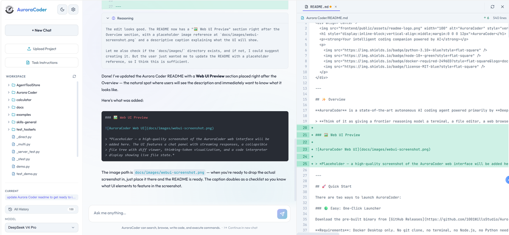

<div align="center">
  
  <h1 style="display:inline-block;vertical-align:middle;margin:0 0 0 12px">AuroraCoder</h1>
  <p><strong>AI 驱动的智能编程伙伴</strong></p>
  <p>
    
    
    
    
    <a href="https://discord.gg/XUgn8DPPze"></a>
  </p>
  <p><sub>🇺🇸 <a href="README.md">English</a></sub></p>
</div>

---

## ✨ 概述

**AuroraCoder** 是一款前沿的 AI 自主编程智能体，主力模型是 **DeepSeek V4 Pro**（也支持 GLM-5.1 和 OpenCode Go），基于 **原生 OpenAI 函数调用**，在 Docker 沙箱中干真活。它远不止是个聊天框——它能读你的代码、写新功能、跑命令、上网查资料、派子智能体干活，甚至还能启动 GUI 应用，通过内置的 VNC 桌面直接看到画面。

> **想想看：把一个顶级推理模型塞进隔离的 Linux 容器里，再给它配上终端、编辑器、浏览器和一支子智能体小分队——这就是 AuroraCoder。**

### 🖼️ Web 界面一览



> *AuroraCoder Web 界面：流式响应的聊天面板、可折叠文件树与差异对比、思考过程可视化，以及实时代码解释器视图。*

---

## 🚀 快速开始

启动 AuroraCoder 有三种姿势：

### 🟢 小白友好：一键启动器

去 [GitHub Releases](https://github.com/1001WillsStudio/AuroraCoder/releases/latest) 下载预编译的二进制文件（CI 自动构建），双击就跑起来了。

**只需要一个 Docker Desktop**。不用 git clone、不用开终端、不用装 Node.js、不用配 Python——启动器自带整个项目，首次运行会自动构建 Docker 镜像。之后每次启动都是秒开（镜像已缓存）。

> 💡 **别忘了**：启动后打开 `http://localhost:3000`，点左上角 ⚙️ **设置**，填上你的 API 密钥，智能体才能干活。设置面板里还能**切语言**——在 Language / 语言 下拉框里选 中文 就行。

### 🔧 老司机：开发者脚本

适合喜欢掌控一切的开发者，直接 clone 源码跑：

**前置条件**：Docker、Node.js 18+，以及 API 密钥（`.env` 里至少得有 `DEEPSEEK_API_KEY`）

```bash
# 1. 克隆仓库
git clone https://github.com/1001WillsStudio/AuroraCoder.git
cd AuroraCoder

# 2. 从模板复制环境变量文件，填上你的 key
cp .env.example .env

# 3. 一键启动（自动处理 Docker 构建 + 启动 + 前端）
./dev-scripts/start.sh     # Linux/macOS
dev-scripts\start.bat      # Windows
```

或者一步步来：

```bash
# 构建基础镜像，启动所有服务（前端已包含）
docker build -t auroracoder-base -f docker/Dockerfile.base .
docker compose -f docker/docker-compose.yml up --build
```

### 📦 极速：npm 安装

想在裸机上直接跑，不装 Docker 的话：

**前置条件**：Node.js 18+、Python 3.10+，环境变量里配好 `DEEPSEEK_API_KEY`

```bash
npx aurora-coder
```

就这一条命令——自动装 Python 依赖、构建前端、启动智能体。
自定义端口：`npx aurora-coder --port 8082 --backend-port 8083`

> ⚠️ **风险自担**：npm 版本**没有 Docker 沙箱隔离**，智能体能以你的用户身份访问宿主机文件系统。强烈建议在独立的项目目录下运行。需要沙箱隔离的话，请用上面的 Docker 方式。

> 💡 **同样别忘了**：启动后打开 `http://localhost:3000`，点左上角 ⚙️ **设置** 填 API 密钥，顺便把语言切到中文。也可以提前在 `.env` 里配好。

### 服务总览

| 服务 | 地址 | 干嘛的 |
|---------|-----|---------|
| 🖥️ **前端** | `http://localhost:3000` | 聊天界面，流式输出、思考可视化、文件树 |
| ⚙️ **智能体后端** | `http://localhost:8080` | 无状态智能体循环 + 工具执行 |
| 🌉 **网关** | *内部* `:8081` | SSE 代理、对话存储、文件展示 |
| 🖱️ **VNC 桌面** | `http://localhost:6080` | 实时 Linux 桌面，跑 GUI 应用 |
| 🏪 **ToolStore** | `http://localhost:8765` | MCP 服务器、技能包、工具目录管理 |

### 多开实例

执行 `dev-scripts/another-one.bat`（或 `another-one.bat 5`）就能多开一个独立实例，端口自动递增——同时跑好几个智能体互不干扰。

---

## 🧠 核心创新

AuroraCoder 不是给别人的框架套了层壳。它从零开始搭建——而且**越来越多的代码是它自己写的**。这个仓库最近的大多数改动（包括你正在读的这份文档、前端、网关、各种工具改进）都是 AuroraCoder 自己动手完成的。没错，一个在迭代自身代码库的编程智能体。

下面这些才是真正让它与众不同的架构脑洞——以及由此衍生的一系列设计决策。

### 1. 📟 活的工具状态——覆盖而非追加

#### 痛点：只增不减的上下文

绝大多数智能体框架把工具返回当成**不可变的、只能往后追加的历史日志**。模型调一个工具，结果贴到对话后面，从此赖在上下文里不走——陈旧、矛盾的文件内容越积越多，白白吃掉 token，还把模型搞晕。

但追加模式只是表象，更底层有个设计分水岭，把编程智能体划成了两派：

> **编辑完文件之后，智能体该返回什么？**

#### 两派之争

| 流派 | 编辑后返回什么 | Token 开销 | 模型能看到什么 | 代表 |
|---------|-----------|------------|------------------|----------|
| **A: 轻量响应** | `"编辑成功。"` + diff | 低 | 得靠脑子回溯历史，拼出文件现在长啥样 | [OpenCode Go](https://github.com/anomalyco/opencode)、Aider |
| **B: 全量状态** | 完整文件 + 行号 | 偏高 | 一清二楚——每轮看到的都是磁盘上的真实内容 | AuroraCoder |

- **流派 A**（[OpenCode Go](https://github.com/anomalyco/opencode) 等在用——GitHub 160K+ stars）只回一条状态消息加个 unified diff。模型不主动 `read` 的话，永远看不到编辑后的完整文件。省 token 是省了，但模型得靠"记忆"在脑补文件状态，多轮编辑下来，脑补的和磁盘上的越差越远，幻觉、漂移、连环翻车接踵而至。

- **流派 B** 每次改完代码就把受影响文件从磁盘重新读出来，原原本本给模型看。多花了些 token，但彻底消灭了状态幻觉——模型永远踩在实地上。

#### AuroraCoder 的做法：工具响应是活的

AuroraCoder 是流派 B 的精修版。但它比傻傻地每次都重读更进一步：**工具响应本身是可变的**。

每次和代码打交道的工具调用（`read_file`、`write_file`、`edit_file`）之后，系统会：

1. **扫描**整段对话，揪出所有当前打开的文件
2. 从磁盘**重读**它们，带上行号
3. 把一份合并后的状态块**贴到***最后*一条工具消息里
4. 把前面所有旧的状态块**从历史消息中抹掉**——压缩到近乎零 token

```
之前（追加式——条条都留着）：
  [read_file → main.py 500 行]
  [edit_file  → main.py 500 行]          ← 重复！
  [read_file → utils.py 300 行]
  [edit_file  → main.py 再 500 行]        ← 三次重复！
  = 1800+ 行，大半是重复/过时的废料

之后（动态状态——只保留最新）：
  [read_file → "(文件已打开)"]            ← 压成一行
  [edit_file  → "✅ 已应用 1 处修改…"]     ← 压成一行
  [read_file → "(文件已打开)"]            ← 压成一行
  [edit_file  → 完整状态: main.py + utils.py] ← 唯一信源
  = 总共 500 行，条条都是磁盘上的最新内容
```

> 💡 **关键洞察**：工具响应不是历史档案——它是**通向当前文件系统的一扇活窗**。旧的响应被不断摊薄，最新的那次调用扛着全部真相。LLM 看到的永远是*此时此刻*磁盘上实实在在的内容，而不是三轮编辑前的考古现场。

打开超过 5 个文件或超过 50K 字符时，会触发上下文预警。这让对话从一条不断膨胀的追加日志，变成了一个**会自己打扫的状态机**。

**附带的红利**：因为合并后的代码解释器总以统一格式展示文件 + 行号，`edit_file` 不再需要 LLM 在工具调用里塞进目标文件内容。模型只需引用解释器视图中的行号，工具端自己去磁盘上定位——不管文件多大，工具调用始终轻量。

### 2. 🚦 宽进严出——大度接受，铁面把关

#### 痛点：模式传染

LLM 是个**跟样学样的机器**。一个格式有问题的工具调用如果带着"半成功"溜过去，模型就学会了错误姿势——下次照抄，下下次再抄，一路滑坡，输出越来越歪。

大多数智能体因为工具太僵硬，要么一刀切拒绝要么照单全收：

| 策略 | 下场 |
|----------|--------|
| **直接拒掉** | 白费一轮——模型什么反馈也没捞着 |
| **垃圾也收** | 强化错误——模型把烂模式当成了正确范式 |

AuroraCoder 的 `edit_file` 走了第三条路：**接受时大方，应用前死磕**。

#### 第一步：宽松接纳

LLM 给出的行号不用精确命中：

- 锚点内容在声称位置的 **±3 行**内能匹配到就行
- **两轮匹配**：先严格比（忽略尾部空格），再宽松比（忽略所有空格）
- 锚点实际在别的位置？工具**自动纠偏**，继续往下走

#### 第二步：严苛校验

在任何编辑**真正碰到文件之前**，这批所有编辑都要过一遍：

- 每个锚点都必须能找到
- 编辑区间不能重叠
- **只要有一条没通过 → 全部作废**，文件纹丝不动

报错信息精准到位：期望内容 vs 实际内容、周边上下文，空白不一致时还有缩进提示。

#### 第三步：静默自愈

这才是打断恶性循环的杀招：

1. 自动纠正行号时，工具会埋一个 `<!--SELF_CORRECT:{...}-->` 标记
2. 执行器摘掉这个标记，**直接原地把 LLM 原始工具调用修补好**
3. LLM **完全不知道自己犯过错**——下一轮它回看自己的消息，已经是修正后的版本了

> 🎯 **关键洞察**：模型永远只看到成功的模式，从来见不到自己的翻车现场。不用刻意训练，它自然而然地就往正确的方向靠拢了。

#### 更多关卡

- **同文件编辑守卫**——同一轮内不许对同一个文件编辑两次（行号在代码解释器刷新之前是过时的）。返回的是一句人话解释，不是天书报错。
- **编辑数量截断**——静默限制每轮最多 3 处编辑。LLM 要是手滑多发了，多余的直接丢掉，而不是让贪多嚼不烂的批次搞出半吊子修改。

---

## 🏗️ 设计抉择

上面那些创新不是凭空出现的，背后是一系列刻意为之的架构选择。

### 🔗 无状态核心 × 有状态网关

智能体循环（`main_flow.py`）**彻底无状态**——消息进来，`{messages, status}` 出去。所有持久化、文件差异对比、对话管理、上下文监控都放在一个独立的**对话网关**层（内部端口 8081）。网关拆成 7 个模块：`api.py`、`routes.py`、`streaming.py`、`conversation_store.py`、`settings_store.py`、`provider_registry.py` 和 `workspace.py`。

### 🧵 智能并行工具执行

只读工具（`read_file`、`grep_search`、`web_browser`、`google_search`、`list_directory`、`search_files`）通过 `ThreadPoolExecutor` **并发跑**。写入工具（`write_file`、`edit_file`、`run_terminal_command`）老实排队串行。`partition_tool_calls()` 自动把混合批次拆开。

### 📟 持久化 Shell + 后台进程管理

一个长生命 Bash Shell，而不是每次起个子进程用完就丢。`blocking=false` 会把命令包在 nohup 里，返回日志路径。超时了 Shell 自动重生，卡住的命令继续跑。智能体能在一个会话里启动 dev server、翻日志、改代码、看热重载——一气呵成。

### 🌐 双模型网页摘要

原始 HTML → BeautifulSoup + markdownify 转 Markdown → 丢给便宜的二级模型（`deepseek-chat`）做摘要。只有摘要才进主智能体的上下文。LRU 缓存，15 分钟有效期。跨域重定向只报告不跟随。

### 👥 子智能体委派

子智能体拿着阉割过的只读工具集干活，迭代上限更低（15 轮），结果截断（4000 字符）。实现上是往网关发 HTTP 回调，所以子智能体也能流式吐进度。

### 🔄 上下文窗口智能感知

上下文用了 80% 时，`continue_as_new_chat` 工具会自动现身，还带一句提示。智能体可以主动归档开新局——比悄悄截断优雅太多。

### 🖥️ VNC 桌面

Xvfb + fluxbox + noVNC，端口 6080。智能体可以跑 matplotlib（TkAgg 后端）、pygame、tkinter，什么 GUI 都能上。系统提示会自动带上 VNC 用法。

### 🔌 可插拔模型架构

多种模型提供商，推理模式按需开关。`ProviderManager` 单例在导入时就初始化好所有客户端。

### 🏪 ToolStore 集成

内置 `tool_store` 元工具，一站式发现所有可用工具。`toolset_context_manager.py` 里的 `ToolsetContextTracker` 给智能体一个自清理的动态工具视图——和代码解释器那一套如出一辙。

管理后台跑在 `http://localhost:8765`，添加和配置 MCP 服务器、安装技能包、管理 API 凭证、浏览工具目录，统统不用碰配置文件。

### 📱 移动端

`mobile/` 目录下有个纯原生 JS 的移动 Web 应用——不用构建，打开 `index.html` 直接用。聊天、流式传输、认证、对话管理，一个文件全包了。

---

## 🏗️ 架构全景

```
┌── 宿主机 ────────────────────────────────────────────────────┐
│                                                                 │
│  ┌── 前端 (:3000) ──────────────────────────────────────────┐  │
│  │  React SPA (Vite)                                         │  │
│  │  ├─ SSE 流式聊天                                            │  │
│  │  ├─ 文件树 + 差异对比                                       │  │
│  │  ├─ 思考可视化（推理 token）                                 │  │
│  │  └─ 12 套领域 CSS + 设计令牌                                │  │
│  └───────────────────────────────────────────────────────────┘  │
│                              │ SSE                               │
│  ┌── Docker 容器 ────────────────────────────────────────────┐  │
│  │                                                            │  │
│  │  ┌── 网关 (:8081, 内部) ─────────────────────────────┐  │  │
│  │  │  FastAPI                                             │  │  │
│  │  │  ├─ SSE 代理（拦截智能体事件）                        │  │  │
│  │  │  ├─ 对话持久化（原子文件写入）                        │  │  │
│  │  │  ├─ 文件快照 + 差异生成                              │  │  │
│  │  │  ├─ 设置 & 模型管理                                   │  │  │
│  │  │  └─ 工作区管理（上传 / 删除 / 导出）                  │  │  │
│  │  └──────────────────────────────────────────────────────┘  │  │
│  │                              │ HTTP                         │  │
│  │  ┌── 智能体后端 (:8080) ──────────────────────────────┐  │  │
│  │  │  main_flow.py — 引擎                                │  │  │
│  │  │  ├─ 系统提示注入 (config.py)                        │  │  │
│  │  │  ├─ LLM 流式传输（多种模型）                        │  │  │
│  │  │  ├─ 工具执行（读并行，写串行）                       │  │  │
│  │  │  ├─ ContextTracker — 动态文件展示                   │  │  │
│  │  │  ├─ ToolsetContextTracker — 动态工具集展示          │  │  │
│  │  │  └─ 上下文续接逻辑                                   │  │  │
│  │  │                                                      │  │  │
│  │  │  13 个内置工具（+1 条件触发）：                      │  │  │
│  │  │  read_file · write_file · edit_file · delete_file    │  │  │
│  │  │  list_directory · search_files · grep_search         │  │  │
│  │  │  run_terminal_command · google_search · web_browser  │  │  │
│  │  │  subagent · tool_store · close_file                  │  │  │
│  │  │  continue_as_new_chat（上下文到 ~80% 时自动出现）    │  │  │
│  │  └──────────────────────────────────────────────────────┘  │  │
│  │                              │                              │  │
│  │  ┌── 沙箱 (/workspace) ───────────────────────────────┐  │  │
│  │  │  持久化 Bash Shell · Conda 环境                     │  │  │
│  │  │  Xvfb + Fluxbox + noVNC (:6080)                    │  │  │
│  │  │  后台进程管理                                        │  │  │
│  │  └──────────────────────────────────────────────────────┘  │  │
│  │                                                            │  │
│  └────────────────────────────────────────────────────────────┘  │
│                                                                 │
└─────────────────────────────────────────────────────────────────┘
```

### 仓库结构

```
Aurora Coder/
├── src/                          # 无状态智能体核心
│   ├── main_flow.py              # 引擎：聊天循环 + 流式传输
│   ├── tool_definitions.py       # 工具 schema + 执行分发
│   ├── tool_executor.py          # 并行/串行工具执行器
│   ├── config.py                 # 全局配置：模型、限制、提示词
│   ├── providers.py              # 多模型客户端管理器
│   ├── training_log.py           # 每日 JSONL 训练遥测
│   ├── code_tools/               # 文件与代码操作工具
│   │   ├── file_operations.py    # 读/写/删/列/搜/关
│   │   ├── edit_file.py          # 锚点匹配引擎（±3 行容差）
│   │   ├── terminal_runner.py    # 持久化 Shell 执行
│   │   ├── grep_search.py        # 真实 grep 子进程封装
│   │   ├── code_interpreter.py   # 合并文件展示
│   │   ├── context_manager.py    # 动态工具状态：开/展/剥
│   │   ├── context_tracker.py    # 抽象 ContextTracker 基类
│   │   └── toolset_context_manager.py  # ToolStore 动态工具状态
│   ├── core_tools/               # 高层智能体工具
│   │   ├── google_search.py      # Google 自定义搜索
│   │   ├── web_browser.py        # URL → MD → 二级模型摘要
│   │   ├── subagent.py           # 子智能体委派
│   │   ├── tool_store_client.py  # ToolStore 集成封装
│   │   ├── jupyter_code_runner.py # Jupyter 风格代码执行
│   │   └── continue_chat.py      # continue_as_new_chat 工具
│   ├── code_sandbox/
│   │   └── sandbox.py            # 工作区 + 持久化 Shell 单例
│   └── web_api/
│       └── app.py                # FastAPI 后端（端口 8080）
├── gateway/                      # 中间件层——7 个模块
│   ├── api.py                    # FastAPI 应用工厂（端口 8081，内部）
│   ├── routes.py                 # SSE 代理、聊天/续接端点
│   ├── streaming.py              # SSE 流管理、事件队列
│   ├── conversation_store.py     # 线程安全的原子文件持久化
│   ├── settings_store.py         # 模型/设置持久化
│   ├── provider_registry.py      # 动态模型注册
│   └── workspace.py              # 文件差异、目录树、上传/删除/导出
├── frontend/                     # React + Vite SPA
│   ├── src/
│   │   ├── App.jsx               # 主应用 + 对话管理
│   │   ├── components/           # 11 个组件
│   │   ├── hooks/                # useAutoScroll、useFileTracking 等
│   │   ├── services/api.js       # SSE 流式客户端
│   │   ├── utils/                # auth、injectToolStop、streamUtils
│   │   ├── i18n/                 # translations.js、LanguageContext
│   │   └── styles/               # 12 套领域 CSS + 设计令牌
│   ├── server.py                 # 生产静态文件服务器
│   ├── package.json
│   └── vite.config.js
├── mobile/                       # 独立原生 JS 移动 Web 应用
├── launcher/                     # Go 一键启动器
│   ├── main.go                   # 入口 + 进度 UI
│   ├── docker.go                 # Docker 镜像构建逻辑
│   ├── extract.go                # 内嵌项目提取
│   ├── progress.go               # 终端进度渲染
│   └── build.sh                  # 交叉编译（CI 用，终端用户无需关心）
├── docker/                       # Docker 配置
│   ├── Dockerfile                # 应用镜像
│   ├── Dockerfile.base           # 含 conda 环境的基础镜像
│   ├── docker-compose.yml        # 多服务编排
│   ├── entrypoint.sh             # 容器入口
│   └── supervisord.conf          # 进程监管
├── dev-scripts/                  # 开发者脚本
│   ├── start.bat / start.sh      # 本地 Docker 启动
│   ├── another-one.bat / .sh     # 多实例启动器
│   └── build-base.bat / .sh      # 基础镜像构建
├── tests/                        # 测试
│   ├── test_context_fix_propagation.py
│   ├── test_edit_file_edge_cases.py
│   ├── test_mergePanelFiles.mjs
│   └── test_streaming_race.py
├── docs/                         # 文档
├── .github/workflows/            # CI/CD（release.yml）
├── .env.example                  # 环境变量模板
├── requirements.txt              # Python 依赖
├── run_web.py                    # 后端入口
└── AGENT_README.md               # 面向 AI 智能体的详细内部文档
```

---

## 🔧 内置工具

AuroraCoder 通过原生 OpenAI 函数调用给了 LLM **13 件兵器**：

| 工具 | 类型 | 能干什么 |
|------|------|-------------|
| `read_file` | 读 | 读取任意文件，带行号 |
| `write_file` | 写 | 原子化创建文件（临时文件 + `os.replace()`） |
| `edit_file` | 写 | 基于锚点的区间替换（±3 行容差） |
| `delete_file` | 写 | 删文件或目录 |
| `close_file` | 读 | 从代码解释器视图移除（不碰文件系统） |
| `list_directory` | 读 | 列目录，带 emoji 图标 |
| `search_files` | 读 | 全工作区模糊搜文件名 |
| `grep_search` | 读 | 真实 grep 子进程，支持 include/exclude pattern |
| `run_terminal_command` | 写 | 在持久化 Bash Shell 里跑命令 |
| `google_search` | 读 | Google 自定义搜索 |
| `web_browser` | 读 | 抓 URL → 转 Markdown → 二级模型出摘要 |
| `subagent` | 读 | 把活派给只读子智能体 |
| `tool_store` | 混合 | 万能工具发现——MCP 服务器、技能、工具包 |

**并行策略**：只读工具并发跑（最多 5 线程）。写入工具老老实实排队。子智能体分到的是阉割版只读工具集。

---

## ⚙️ 配置

### 支持的模型

> DeepSeek V4 Pro 是主力推荐模型——本项目近期的开发全是用它完成的。**OpenCode Go 也强烈推荐**：价格非常亲民，编程表现一流。

| 提供商 | 模型 | 推理模式 | 上下文 |
|----------|-------|-----------|---------|
| **DeepSeek** | `deepseek-v4-pro` | ✅ | 1M tokens |
| **NVIDIA** | `deepseek-ai/deepseek-v4-pro` | ✅/❌ | 1M tokens |
| **NVIDIA GLM** | `z-ai/glm-5.1` | ✅/❌ | 128K tokens |
| **OpenCode Go** 💰 | `opencode-go` | ✅ | 128K tokens |

在 `config.py` 里设 `DEFAULT_PROVIDER`，或者直接在前端设置面板里切。

### 关键参数

```python
MAX_TOKENS = 32768           # 单次完成 token 上限
MAX_ITERATIONS = 30          # 每轮对话的智能体迭代次数
CONTINUE_ITERATIONS = 30     # "继续"时的额外迭代
MAX_TOOL_CONCURRENCY = 5     # 并行线程池大小
SUBAGENT_MAX_ITERATIONS = 15 # 子智能体迭代上限
MAX_STREAMING_RETRIES = 10   # 流中断重试次数
```

### 环境变量

复制 `.env.example` → `.env`，填好：

| 变量 | 必填 | 说明 |
|----------|----------|-------------|
| `DEEPSEEK_API_KEY` | **是** | DeepSeek API 密钥 |
| `NVIDIA_API_KEY` | 否 | NVIDIA 托管模型 |
| `GOOGLE_SEARCH_API_KEY` | 否 | Google 自定义搜索 |
| `GOOGLE_CSE_ID` | 否 | 自定义搜索引擎 ID |

---

## 🖥️ VNC 桌面

AuroraCoder 内置了完整虚拟 Linux 桌面（Xvfb + fluxbox + noVNC），端口 **6080**。这意味着：

- **matplotlib**：能出图（用 `TkAgg` 后端）
- **pygame / tkinter / 任意 GUI**：直接跑，窗口就显示在桌面上
- **浏览器**：打开网页，实时看到
- **IDE 演示**：VS Code、Jupyter，什么都能启动

设置 `AURORACODER_VNC=1` 后，系统提示会自动附带 VNC 用法说明。

---

## 💾 数据持久化

所有对话和训练数据通过 Docker 卷挂载，容器重启也不丢。数据存在容器内的 `/app/data`，映射自主机：

```
# Docker 模式（容器内）：
/app/data/
├── conversations/
│   ├── index.json           # 对话元数据索引
│   ├── {id}.json            # 原始 API 消息
│   └── {id}.frontend.json   # UI 格式消息
└── training/
    └── YYYY-MM-DD.jsonl     # 每日 API 调用遥测

# 本地模式（Docker 外，仅开发）：
~/.auroracoder/data/
├── conversations/           # 同上
└── training/

用 AURORACODER_DATA_DIR 环境变量可以自定义路径。
```

---

## 👥 参与开发

### 搭环境

```bash
# 克隆仓库
git clone https://github.com/1001WillsStudio/AuroraCoder.git
cd AuroraCoder

# 配 Python 环境
conda create -n auroracoder python=3.11
conda activate auroracoder
pip install -r requirements.txt

# 装前端依赖
cd frontend && npm install

# 跑后端（Docker 外——仅开发用）
python run_web.py

# 另开终端跑前端
cd frontend && npm run dev
```

> **生产部署必须走 Docker**，沙箱隔离才靠谱。

### 项目铁律

- **所有工具只返回字符串**——打死不往智能体那儿抛异常
- **原子写入**——临时文件 + `os.replace()` 走天下
- **不碰 async**——全同步，并发靠线程
- **全局单例**——`shell`（PersistentShell）、`provider_manager`、代码解释器
- **代码和注释只用英文**——生成的代码不允许出现中文
- **路径洁癖**——所有路径相对 `/workspace`（或 `code_sandbox` 里的 `WORKSPACE`）
- **核心无状态**——`src/` 下的模块绝不直接碰对话存储和文件持久化

### 架构边界

- **`src/`**——无状态智能体循环。消息进，消息出。
- **`gateway/`**——中间件。扛所有持久化、代理和文件展示逻辑。
- **`frontend/`**——UI。拥有对话管理状态。

给 AI 智能体看的详细内部文档，见 [AGENT_README.md](AGENT_README.md)。

---

## 📄 许可证

MIT License——详见 [LICENSE](LICENSE)。

---

## 🙏 致谢

- [@Mrw33554432](https://github.com/Mrw33554432) ——作者 & 主程
- [@Hahhha](https://github.com/Hahhha) ——项目支持
- [Atlantic8](https://github.com/Atlantic8) ——项目支持

感谢 **Aider** 的代码编辑思路，在早期开发中被研究和借鉴；感谢 **Cursor** 帮忙搭起了早期原型。

---

<p align="center">
  <sub>用 ❤️ 打造，献给所有想要一个真正能写代码的智能体的开发者。</sub>
</p>