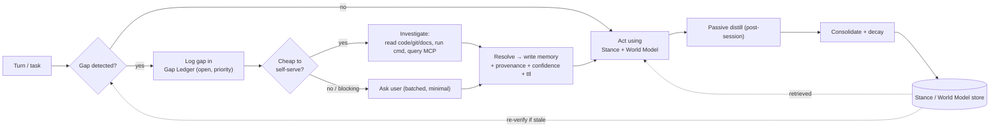
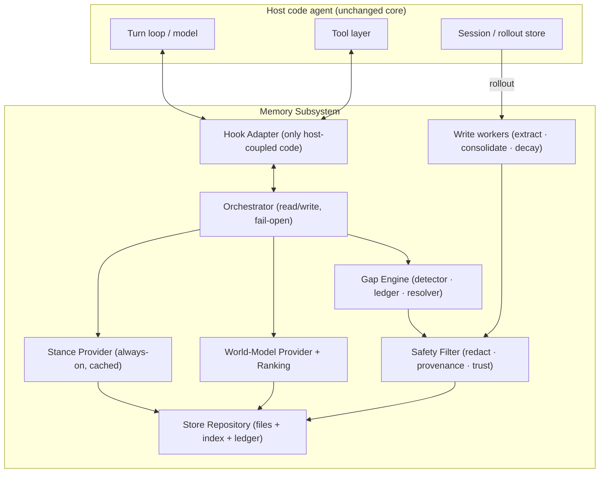

# Code Agent Memory: Survey & Design

Design doc for a memory subsystem for a code agent. Part I surveys how shipping code
agents handle memory (with source-level evidence). Part II proposes a design for our agent,
built around two purposes — giving the agent an **attitude** toward the user, and **closing the
knowledge gap** between user and agent (including the agent actively collecting the info it is
missing, the way a human engineer onboards).

---

# Part I — How existing code agents handle memory

## 0. What "memory" is actually for

Across every system studied, useful long-term memory is **not** conversation recall. It is the
small set of durable, non-derivable facts that change the next session's default behavior:

- stable user/team **preferences** and **corrections** ("always run ruff", "no trailing summaries"),
- **project** context not in the code (goals, ownership, incidents, deadlines),
- **procedural** shortcuts and **landmines** (hard-won paths, failure modes),
- **pointers** to external systems (Linear/Grafana/Slack/runbooks).

The recurring principle: optimize for *future user keystrokes saved* (fewer re-specifications and
corrections), and keep out of memory anything derivable from **code + git + AGENTS.md**.

## 1. Codex (OpenAI) — self-distilling, two-phase, git-versioned, usage-ranked

Source: `openai/codex`, crate `codex-rs/memories/` (`read`, `write`) + `core/src/memories/`.

- **Trigger**: on root-session start, async in background; only if the session is non-ephemeral,
  memory is enabled, it is not a sub-agent, and the state DB is available. Per-thread column
  `memory_mode` (default `enabled`).
- **Two phases**:
  - **Phase 1 (per-rollout extraction)**: claim eligible past rollouts (source allowlist, age
    window, idle-long-enough, DB-leased), filter to memory-relevant items, ask a model to emit
    `{raw_memory, rollout_summary, rollout_slug}`, **redact secrets**, store as stage-1 rows.
    A strict **no-op gate** ("will a future agent plausibly act better because of this?") means
    most sessions store nothing.
  - **Phase 2 (global consolidation)**: single global lock; select top-N stage-1 outputs
    ranked by **`usage_count` then recency** (`last_usage`/`generated_at`), within
    `max_unused_days`; sync on-disk artifacts (`raw_memories.md`, `rollout_summaries/`,
    `MEMORY.md`); spawn a **consolidation sub-agent** (no network, local-write only) to fold the
    git diff into consolidated memory; commit a new git baseline.
- **Storage**: git-versioned `~/.codex/memories/` (human-readable, diffable) + `memories_1.sqlite`
  (`stage1_outputs`, `jobs`). Verified locally: `stage1_outputs(usage_count, last_usage,
  selected_for_phase2, …)` + a leased `jobs` queue.
- **Read**: injects memory as developer instructions (`read/templates/memories/read_path.md`),
  with parsed **memory citations** and **usage telemetry** that feeds back into Phase-2 retention.
- **Safety**: rollouts/tool outputs are **data, not instructions**; secrets redacted.

Signature idea: **memory as a compression pipeline** — extract per-session, consolidate globally,
retain by actual usage, keep it as versioned files.

## 2. Claude Code (Anthropic) — agent-driven, typed, file-based memory tool

Source: local binary `~/.local/share/claude/versions/2.1.69` (Bun-compiled) string analysis.

- **Mechanism**: the Anthropic **memory tool** — *"store and retrieve information across
  conversations through a memory file directory … create, read, update, delete files that persist
  between sessions,"* operating on a `/memories` directory (telemetry
  `tengu_memdir_file_read|write|edit|loaded`).
- **The agent decides what to save** (not the user). Four **typed** memories, each with
  `when_to_save` / `how_to_use` / examples in the tool prompt:
  - `user` — role/expertise/preferences (tailor explanation depth),
  - `feedback` — corrections; store the **why**; called *"a very important type,"*
  - `project` — goals/incidents/ownership/deadlines; **normalize relative→absolute dates**,
  - `reference` — pointers to external systems (Linear/Grafana/Slack).
- **Storage format**: one markdown file per memory with frontmatter
  `name` / `description` (used for relevance) / `type`. Guidance: *update an existing memory
  before writing a new one* (dedup).
- **Explicit "What NOT to save"** (anti-bloat gate): no code patterns/paths/architecture
  (derivable), no git history, no fix recipes, nothing already in CLAUDE.md, no ephemeral state.
- **Retrieval = a dedicated LLM selection call**: candidate files sorted by **mtime desc and
  capped** (`slice(0, L)`), then a small `max_tokens: 256` JSON-schema call receives the
  **user query + each file's name+description** and returns `selected_memories: string[]`
  (validated), injected as *"Potentially relevant memories."*
- **Access rules**: use when a known memory seems relevant, when the user refers to prior work,
  and **must** access when the user says "remember/recall/check your memory."
- **Static layer underneath**: `CLAUDE.md` hierarchy (enterprise/project/user), `#` quick-add,
  `@path` imports.

Signature idea: **typed, description-indexed markdown memory with query-aware LLM selection**, on
top of static CLAUDE.md.

## 3. Cursor — human-approved auto-facts + static rules, no request-time chat retrieval

Source: Cursor product docs (`/docs/rules`, `/help/customization/*`) + v1.0 changelog.

- **Memories**: a background "observation" model **proposes** short facts from chats; the **user
  approves** them; stored per-project/per-user in Cursor's settings store. Toggle at
  Settings → Rules → "Generate Memories". Only auto-generated layer.
- **Rules** (static): four scopes — Project (`.cursor/rules/*.mdc`), User, Team, `AGENTS.md`/
  `CLAUDE.md`. Frontmatter (`alwaysApply` / `globs` / `description`) drives attachment
  (always / glob-auto / agent-requested via LLM-judged `description` / manual). Precedence
  Team → Project → User.
- **Retrieval**: **no native embedding/retrieval over past chats at request time**; cross-chat
  context is manual (`@Past Chats`); codebase indexing embeds files, not memory. Attachment is
  boolean, not a numeric rank.

Signature idea: **human-in-the-loop approval** for auto-memory; relevance via rule `description`.

## 4. OpenCode (sst) — pure static instruction files, deterministic, no learned memory

Source: `sst/opencode`, `packages/opencode/src/session/instruction.ts`.

- **No auto-memory, no store, no embeddings, no write-back.** Memory = instruction files.
- **Sources**: global `~/.config/opencode/AGENTS.md` (+ compat `~/.claude/CLAUDE.md`); project
  files found by walking up cwd→worktree, **first match wins** among `AGENTS.md` / `CLAUDE.md` /
  `CONTEXT.md`(deprecated); plus config `instructions` (globs) and remote `http(s)` URLs. Injected
  as `Instructions from: {path}\n{content}`.
- **Read-triggered nested attachment**: when the agent **reads a file**, it walks upward from that
  file's directory and attaches nearby `AGENTS.md`/`CLAUDE.md`, **once per message** (dedup map) —
  spatial, on-demand context with no store.

Signature idea: **zero learned memory**; deterministic path-based instruction loading + spatial
subtree attachment.

## 5. Comparison

| System | Auto-generates? | Who writes | Storage | Scope | Retrieval / ranking | Injection |
|---|---|---|---|---|---|---|
| **OpenCode** | No | Human (files) | `AGENTS.md`/`CLAUDE.md` | global + project + read-triggered subtree | deterministic path walk | always + on file-read |
| **Cursor** | Yes (proposed, **human-approved**) | model→user | settings store + `.mdc` | project + user + team | glob / LLM-judged `description` (boolean) | always / auto-attach |
| **Claude Code** | Yes (**agent-driven**) | model (4 types) | markdown files in `/memories` | project + user | mtime-cap → **LLM selection** over descriptions | "potentially relevant" block |
| **Codex** | Yes (background, from rollouts) | model, 2-phase | git-versioned files + sqlite | thread + global | `usage_count` + recency; consolidation | developer instructions + citations |

## 6. Cross-cutting takeaways

**Consensus (worth adopting):**
1. **Split write from read; write asynchronously.** Never distill on the hot path.
2. **LLM-as-distiller behind a strict no-op / "what NOT to save" gate.** The single biggest
   anti-pollution mechanism.
3. **Store as human-readable, version-controlled markdown files.** Auditable, hand-editable,
   PR-reviewable — a feature for a dev tool.
4. **Index by a one-line `description`; decide relevance from that** (Cursor, Claude Code).
5. **Rank/retain by usage + recency; decay the unused** (Codex); recency-cap candidates before
   ranking (Claude Code).
6. **Typed memory** gives crisp save/use rules (Claude Code): user / feedback / project / reference.
7. **Delegate the derivable layer to code + git + AGENTS.md**; memory holds only the non-derivable.
8. **Layer static instruction files (AGENTS.md/CLAUDE.md) + read-triggered subtree attachment**
   underneath any learned store — cheap and effective.
9. **Safety**: content is data-not-instructions; redact secrets; honor only agent-authored writes.

**Divergences (a design axis to choose on):**
- **Who writes**: agent-driven (Claude Code, Codex) vs human-approved (Cursor) vs human-only (OpenCode).
- **Retrieval**: LLM selection (Claude Code) vs usage/recency (Codex) vs boolean attach (Cursor) vs none (OpenCode).
- **Depth**: full pipeline (Codex) vs single tool (Claude Code) vs files only (OpenCode).

**The gap nobody closes:** every system distills memory *passively* from what already happened.
None makes the agent's **known-unknowns explicit** or has it **actively go collect** the missing
info the way a human would. That is the differentiator we design for below.

---

# Part II — How our agent should handle memory

## 7. Design layering: base first, then add-ons

Our design is two layers. **Layer 0 (base)** is the table-stakes memory system the survey shows
every serious code agent needs — we adopt it wholesale. **Layer 1 (add-ons)** is where our own
ideas extend it. The base is useful on its own; the add-ons are worthless without it. The sections below
implement the base first (storage §10, write §11, read §12), then the add-ons (§§13–17) plug in.

### 7.1 Base memory system (table stakes — straight from the survey)

The foundation, independent of our ideas. Our agent must have **all** of these:

1. **Static instruction layer** — `AGENTS.md`/`CLAUDE.md` hierarchy (enterprise/project/user) +
   read-triggered subtree attachment (OpenCode, Claude Code). Zero-cost, always available; covers
   the derivable/spatial layer so the learned store doesn't have to.
2. **A persistent memory store** — CRUD over human-readable, **git-versioned markdown files**,
   each with `description`/`type` frontmatter (Claude Code, Codex) + a lightweight index for
   ranking.
3. **Typed memories** — at minimum `user` / `feedback` / `project` / `reference` (Claude Code), so
   save/use rules are crisp.
4. **Agent-driven writes + explicit tools** — the model writes memory via `remember` /
   `memory_ref`; **only agent-authored writes honored**. Optional `recall` pull tool.
5. **No-op / "what NOT to save" gate** — the anti-bloat rule: never store what's derivable from
   code + git + AGENTS.md; skip ephemeral facts (Codex, Claude Code).
6. **Query-aware retrieval + injection** — description-indexed, recency-capped candidates → rank
   (LLM selection and/or BM25 + usage/recency) → inject top-k (Claude Code, Codex, agent-core).
7. **Async write pipeline: extract → consolidate → decay** — passive distillation from session
   rollouts, dedupe/merge, usage-decay, off the hot path, leased for concurrency (Codex two-phase).
8. **Safety** — data-not-instructions, secret redaction, provenance/confidence, fail-open.

This base alone already matches or exceeds Claude Code / Codex. Everything below is **additive**.

### 7.2 Add-ons (our extensions, layered on the base)

Two additions, both optional layers over the base — clearly separable so the base can ship without
them:

- **A. Organize memory around purpose — Stance vs World Model.** Rather than a flat typed store,
  group the same typed memories by their **job**: *Stance* (attitude — always injected, cached
  prefix) vs *World Model* (knowledge gap — retrieved on demand). This is a
  **framing + injection-policy** layer over the base store and types; it changes *how* memories are
  grouped and surfaced, not the storage mechanism.
- **B. Gap Engine — active gap-closing (§13).** The base only distills **passively** from what
  already happened. This add-on makes the agent's **known-unknowns explicit** (a Gap Ledger) and
  has the agent **actively collect** the missing info — self-investigate (read code/git/docs, run
  safe commands, query allowed systems) or ask — then write it back with provenance/confidence.
  Net-new machinery bolted onto the base store; disable it and the base still works.
- **C. Reflection — lessons & risk radar (§§14–15).** A self-triggered retrospection step: after
  failures/corrections/surprises, distill a reusable *lesson* ("what would I do better next
  time"), and on *severe* findings run blast-radius reasoning to open related risks. Paired with a
  discipline that makes **silence a first-class, evidence-gated outcome** so the agent stops
  over-producing filler.
- **D. Cross-session themes + adaptive scoring (§§16–17).** A consolidation layer that clusters
  episodic memories into **derived themes** (recurrence across sessions, which flat facts + RAG
  can't express), and replaces hand-set thresholds with **relative / model-judged / outcome-learned**
  salience and retention.

Non-negotiables inherited from the survey (apply to base **and** add-ons): async writes, no-op
gate, versioned markdown files, description-indexed retrieval, usage-decay, redact-and-provenance
safety, delegate-derivable-to-code.

## 8. Conceptual model: base store + two-plane framing + gap loop

The two planes and the gap loop below are the **add-on framing (§7.2)** sitting on top of the base
store (§7.1). Strip the shaded loop and you still have a complete base memory system.



- **Stance** injected **always**, compact, in the cached system-prompt prefix (never busts prompt
  cache).
- **World Model** injected **selectively** via retrieval, out of the cached prefix.
- **Gap Ledger** is a first-class persisted object driving active collection.

## 9. Memory taxonomy

| Plane | Type | Purpose | Write trigger | Injection |
|---|---|---|---|---|
| Stance | `preference` | defaults the user wants unstated | agent, immediate | always |
| Stance | `feedback` | corrections (+why) — highest value | agent, immediate on correction | always |
| Stance | `communication` | tone / verbosity / format | agent | always |
| Stance | `autonomy` | ask-vs-act threshold | agent | always |
| World | `project` | goals/incidents/ownership/deadlines (abs dates) | agent + passive | retrieved |
| World | `reference` | pointers to external systems | agent | retrieved |
| World | `convention` | non-derivable rules (else defer to lint/AGENTS.md) | agent + passive | retrieved |
| World | `landmine` | past failures / gotchas | passive (from rollouts) | retrieved |

## 10. Storage & schema

Git-versioned markdown + a SQLite index; project scope in-repo, stance in user-dir.

```
<project>/.agent/memory/
  stance/*.md         world/*.md
  index.sqlite        # ranking/retrieval metadata
  gaps.sqlite         # gap ledger
~/.agent/memory/stance/*.md   # user-global stance
```

Memory file:

```markdown
---
id: mem_7f3a
plane: world                # stance | world
type: reference
scope: project              # user | project | subtree:<path>
description: "Pipeline bugs are tracked in Linear project INGEST"   # one-liner for relevance
confidence: high            # high | medium | low
provenance: "user stated 2026-07-01"   # or "inferred: git blame src/pipe/*"
volatile: false             # true → carries ttl, re-verify on read
ttl_days: null
usage_count: 0
last_used: null
created: 2026-07-01
supersedes: null
---
When the user references pipeline tickets, check Linear project "INGEST" before asking.
```

Gap Ledger row:

```
gap_id | scope | question | status(open|investigating|resolved|deferred|asked)
       | priority | detected_from | strategy(self|ask)
       | resolved_memory_id | confidence | opened_at | resolved_at | reverify_at
```

## 11. Write path

**Active (in-turn, high precision):**
- User correction/preference → immediate Stance write.
- Agent-emitted `memory_ref` (explicit remember/forget) — **only agent-authored refs honored**.
- Gap resolutions (see §13) → World/Stance write with provenance + confidence.

**Passive (async, post-session)** — two-phase, Codex-style:
- **Extract**: per-session, filter to memory-relevant items, model emits candidate memories,
  behind the **no-op gate** and **"what NOT to save"** rules; redact secrets.
- **Consolidate + decay**: dedupe/merge (update-before-create), drop long-unused, keep frequently
  cited, commit to git. Leased jobs for concurrency safety; fail-open.

## 12. Read path & ranking

- **Stance**: assembled from `stance/*` (capped, e.g. top-15 by usage/recency), cached per
  session, injected in the prefix.
- **World Model**: query-aware retrieval —
  1. **recency-cap** candidates (bound the set),
  2. **hybrid rank**: BM25 over `description`/content (great for identifiers/paths) + optional
     embeddings for fuzzy recall + a usage/recency blend,
  3. take **top-k**, inject as "Potentially relevant context" out of the prefix,
  4. **bump `usage_count`** on cited items → feeds the decay loop.
- **`recall(query)` tool**: let the model also pull on demand (retrieval economy).
- **Volatile entries** carry a TTL and are **re-verified rather than trusted** when stale.

## 13. Gap Engine (the differentiator)

**Detection signals → open a gap:**
- ambiguity the agent resolved by guessing,
- missing convention/ownership/intent needed to act well,
- an external system referenced but not understood,
- **repeated correction on the same axis** (recurring gap = high priority),
- retrieval miss for something that *should* be known.

**Resolution policy (human-like):**
- cheap + locally answerable → **self-investigate** (grep/read code, `git log`/`blame`, docs,
  safe command, allowed MCP/API). Preferred.
- expensive / subjective / blocking → **ask the user**, batched and minimal (respect the
  `autonomy` stance).

**On resolve:** write a World/Stance memory stamped with **provenance** (how learned) and
**confidence**; close the ledger entry linking the memory; set `reverify_at` for volatile facts.

This makes "match the knowledge gap" observable and convergent: the agent stops re-guessing across
sessions, and you can show the user *what it didn't know and how it found out*.

## 14. Reflection: lessons & risk radar (add-on)

A self-triggered retrospection step — the agent critiquing its own run — with two output modes.
Distinct from `feedback` memory (user-authored); this is **self-authored**
(`provenance: self-inferred`, carrying lower trust and easier auto-expiry).

**Triggers (gated, not every turn):** a tool/command error; a test that failed then passed (the
fix *is* the lesson); a retry loop / long detour; a user correction or interruption; a surprising
outcome (expectation ≠ result); a light end-of-task pass.

**Two modes:**
- **Backward — lesson:** `when <situation>, I did <X>, it failed/was slow because <Y>, next time
  do <W>`. Stored as a self-authored `lesson` in the World Model, keyed by a **situation
  signature**, not by the user's words.
- **Forward — risk radar:** on a **severe** finding, do blast-radius reasoning — "if this
  assumption was wrong here, where else does it hold?" — and open Gap-Ledger entries for the
  siblings (same bug pattern, other call sites, shared invariant). This reuses the Gap Engine's
  detect→resolve loop, seeded by severity rather than uncertainty. Record the *class* of problem as
  a `landmine` so future work watches for it.

**Situation-signature retrieval (the hard part):** lessons must surface when a *similar problem*
recurs, so they need a retrieval channel keyed on the situation (error symptom / tool-call pattern
/ area touched / task kind), fired at **decision & error points** — not just at `before_model` on
the user query. Too coarse → wrong lessons fire; too specific → never fires. Prototype this channel
first.

**Bias toward failures / corrections / surprises** (strong signal) over smooth successes (weak
signal that invites fabrication).

## 15. Silence as a first-class outcome (the "always produce something" bias)

Agents are trained to be helpful, which collapses into over-producing — manufacturing low-value
lessons/risks when the honest answer is "nothing to act on." The no-op gate (§11) is the mechanism;
these make it actually hold:

- **Invert the burden of proof.** Default output is `none`; the reflection must *argue past* a null
  against a stated high base rate ("most reflections produce nothing; save only if a future agent
  would concretely act differently"). Codex: no-op is "allowed and **preferred**."
- **Require evidence.** A lesson/risk may be written only if it cites a concrete event from this
  run (the actual error, the actual repeated correction). No evidence → no write. Kills fabrication.
- **Contrastive test.** "Versus just re-deriving it next time (read the code / run the test), does
  this add anything?" If re-derivable in-situ → no-op.
- **Decouple from the user reply.** Reflection is a silent internal pass; its only outcomes are a
  memory write or nothing. Don't narrate "here's what I learned" — that performance breeds filler.
- **Record dead-ends (the subtle one).** An honest "nothing actionable" is worth storing *once* as
  a closed `no-action` / `unresolvable` Gap-Ledger entry — "looked into X, dead end, don't re-dig" —
  so silence doesn't cost repeated effort next session.
- **Calibrate on precision.** Track the fraction of saved memories ever *usefully retrieved*;
  tighten the gate if low, loosen if the store stays empty yet mistakes repeat. Eval on correctly
  no-op-ing, not just on producing.

Caveat: much of this bias is baked in at training time, so the memory layer can only *contain* it —
hence the precision metric, to see whether the gate is holding.

## 16. Cross-session theme detection (episodic → derived memory)

Flat facts + RAG answer "find a session like this," but **cannot express recurrence** ("agent
memory came up in 5 of your last 7 interviews") — that is an emergent property of the whole store,
not any single memory. Add a two-tier structure:

- **Atomic / episodic memory:** one fact per session, tagged with topic(s), an embedding,
  `session_id`, `timestamp`.
- **Derived / theme memory:** computed by a consolidation job — **cluster** recent atomics by
  similarity → **LLM-label** each cluster (handles "the raw facts don't name the behavior") →
  record **spread** (distinct sessions, window, trend) → store as a `theme` with pointers to its
  member episodes.

**Two query types, both required:** *similarity* (top-k RAG, "find like this") and *aggregation*
(group-by / trend, "what recurs, how often, trending how"). Most systems only have the first; the
interview case is purely the second — a rollup/analytics query, not top-k. Precedent: ai-self's
`recent_topics → long_term` promotion and Codex Phase-2 consolidation.

**Surface** frequency/recency-weighted themes at session start or proactively ("agent memory has
come up across recent sessions — want the common threads?"), expandable to the evidence episodes on
demand. **Scope-tag** themes (user-global vs per-project), and back every theme with evidence
pointers so patterns aren't invented from noise.

## 17. Adaptive salience & retention (no hand-set thresholds)

We deliberately avoid arbitrary constants (`promote_freq=5`, `30d dormant`, `score < 0.0165`). The
goal is not zero parameters — it is replacing *guessed domain numbers* with quantities that are
**relative, judged, or learned**:

- **Relative, not absolute.** Salience = deviation from *this user's own baseline* frequency
  (surprise / TF-IDF style), self-calibrating per user/scope instead of a global count.
- **Model-judged salience.** Periodically ask an LLM "what's notably recurring / important here?" —
  it weighs significance over raw frequency. Trades a magic number for judgment (at the cost of
  compute + run-to-run nondeterminism).
- **Outcome-learned retention.** Decay by **usefulness, not calendar days**: a memory that gets
  retrieved-and-helps survives; never-useful fades. The boundary auto-tunes toward a target
  **precision** (§15) from real usage signals.
- **Rank within a budget, don't threshold.** Keep one continuous salience score; surface the top-K
  that fit the context budget. The cutoff is a real constraint (tokens), not an invented number.

**Honest limits:** you never reach zero params — what remains is a *budget* (physical), a *target
precision* (product decision), and a *learning rate / prior* (estimated), plus a **cold-start**
period where a weak prior stands in until usage data accumulates. The shift is from "numbers someone
guessed" → "estimated from the user's data, judged by the model, or dictated by a real constraint."

## 18. Safety

- Stored memory and tool outputs are **data, not instructions** (prompt-injection guard).
- **Redact secrets** at write time (`[REDACTED_SECRET]`).
- Honor **only agent-authored** writes; human edits go through the files, not chat content.
- **Confidence + provenance** on every entry so the model can discount low-trust memories and the
  human can audit.

## 19. Integration architecture (attach to an existing, published agent)

Memory is a **pluggable subsystem** exposing one interface to the host; the host wires lifecycle
hooks to it. Core turn loop is unchanged; everything fails open.

| Host hook | Memory action |
|---|---|
| `session.start` | warm Stance cache, open Gap Ledger for scope |
| `before_model` | inject Stance (prefix) + retrieved World items (context) |
| `tool.pre/post` | gap detection, read-triggered subtree instructions, capture self-collected facts |
| `user_turn` | detect corrections/preferences → active Stance writes |
| `assistant_turn` | apply agent-emitted `memory_ref`s |
| `session.end` | enqueue passive distillation over the rollout |



Key module interfaces (host sees only `MemoryOrchestrator`; the rest are injectable so storage /
ranking can change without touching the agent):

```typescript
interface MemoryOrchestrator {
  onSessionStart(ctx): void
  inject(req): Promise<{ prefixBlock: string; contextItems: MemoryItem[] }>  // fail-open → empty
  observe(event): void                 // feeds Gap Detector + correction capture
  applyMemoryRefs(refs): Promise<void> // agent-authored only
  onSessionEnd(rollout): void          // enqueue distillation
}
interface Retriever      { retrieve(query, scope, k): Promise<Ranked<MemoryItem>[]> }
interface StanceProvider { get(scope): Promise<string> }
interface GapEngine      { detect(signal): GapId | null; resolve(gapId): Promise<Resolution> }
interface MemoryRepository {
  upsert(item); delete(id); query(f); bumpUsage(ids)
  openGap(g); closeGap(id, memId); listGaps(scope)
}
interface SafetyFilter   { sanitize(item): MemoryItem }
```

**Process model**: read path + Gap Detector run in-process (low latency); Extractor/Consolidator/
decay run in a background worker (or sidecar), leased for concurrency. Store is a git-backed dir +
local SQLite; a remote/team store can sit behind the same `MemoryRepository`.

## 20. Cross-cutting concerns

- **Consistency**: eventual — active gap-resolutions are immediate, passive memory lands next
  session; never assume within-turn durability.
- **Concurrency**: lease/lock repository writes; global lock for consolidation.
- **Caching**: Stance is prefix-stable and cached; World items injected after the cached prefix so
  retrieval never busts prompt caching.
- **Observability**: spans/metrics per stage (`memory.inject`, `memory.retrieve`, `gap.open/resolve`,
  `memory.distill`).
- **Versioning**: schema version in frontmatter + index migration table.

## 21. Summary

The field converges on **agent-written, typed, markdown-file, description-indexed memory with an
explicit no-save gate**, layered on static `AGENTS.md`/`CLAUDE.md`. Our design **adopts that whole
base (§7.1) as the foundation** — it is table stakes, not optional — and then layers separable
**add-ons** (§7.2) on top:

- **Stance vs World Model** — organize memory by purpose: attitude (always injected) vs knowledge
  gap (retrieved).
- **Gap Engine** (§13) — make known-unknowns explicit and close them by actively collecting info,
  the way a human onboards.
- **Reflection: lessons & risk radar** (§§14–15) — self-critique after failures/surprises into
  reusable lessons and forward risks, with **silence as a first-class, evidence-gated outcome** so
  the agent doesn't over-produce.
- **Cross-session themes** (§16) — a consolidation layer that detects recurrence across sessions
  (which flat facts + RAG can't express).
- **Adaptive salience & retention** (§17) — replace hand-set thresholds with relative /
  model-judged / outcome-learned scoring.

The base ships and works on its own; every add-on can be disabled independently.
