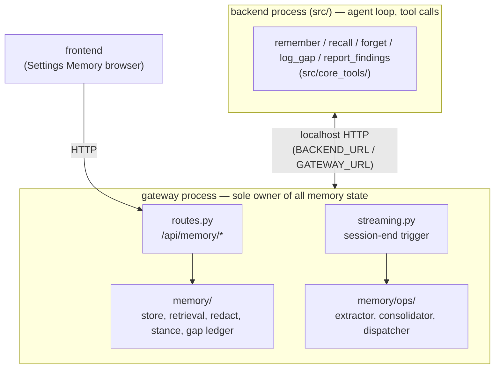
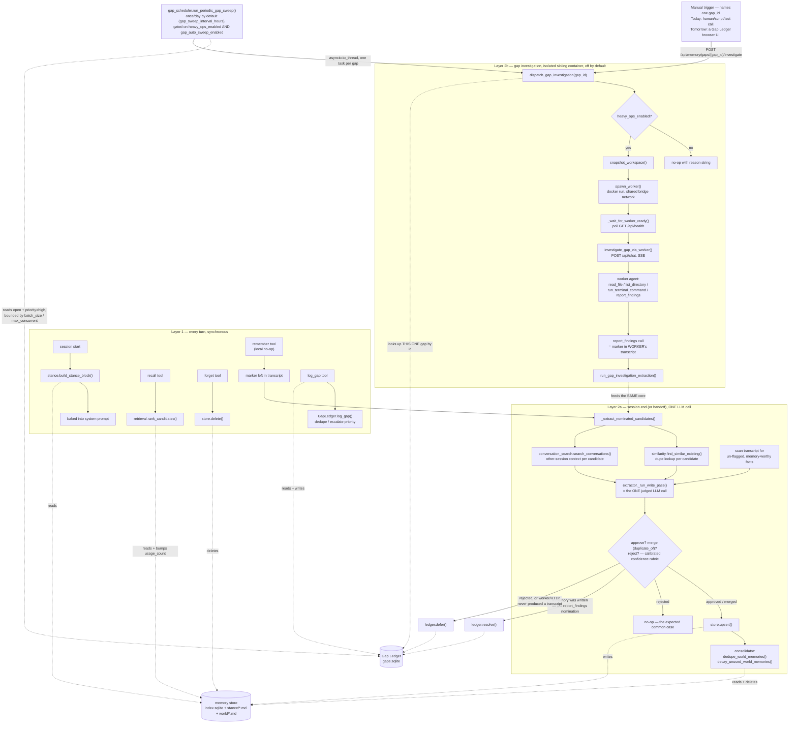

# Agent Memory Module — Final Structure

Branch: `feature/agent-memory`. This is a **reference doc for the system as it
stands today** — what exists, where it lives, and how the pieces fit
together. For the *design rationale and decision history* (why things ended
up this shape), see `docs/memory-implementation-summary.md` and the original
`docs/code-agent-memory-design.md`. This doc doesn't repeat that reasoning;
it's the map you'd want after the fact to find your way around the code.

## 1. The shape of the system, in one picture



Both processes run **in the same container** for a normal session (see
`docker/supervisord.conf`: `agent` on :8080, `gateway` on :8081). The
exception is the Gap Engine (Layer 2b), which spawns a second, throwaway
**sibling** container — a Docker-in-Docker (DooD) worker — that runs only the
`agent` process in a slimmed-down role, with no gateway of its own.

The backend never touches memory's files or SQLite directly. Every write and
every read goes through the gateway's `/api/memory/*` HTTP API
(`src/core_tools/memory_client.py` is the only bridge), exactly mirroring how
the backend already talks to the gateway for conversation storage. Every
call in that client fails open — a memory outage degrades to "no memory this
turn", never a broken agent loop.

## 2. How data moves inside the module

The diagram in §1 shows how the module is *wired up* to the rest of
AuroraCoder. This one is the inside view — every write, read, and gap gets
resolved by one of exactly three flows, and the important thing to notice
is that **Layer 2b never writes memory directly** — it only ever feeds the
same judged pipeline Layer 2a already uses.



A few things worth calling out explicitly:

- **Layer 2b has two independent trigger paths, both converging on the
  same `dispatch_gap_investigation(gap_id)`.** `GAPLOG` (Layer 1's
  `log_gap`) only ever writes an `open` row to the Gap Ledger — logging a
  gap never itself causes an investigation. From there:
  - `MANUALTRIGGER`: something external names one specific `gap_id` and
    calls `POST /api/memory/gaps/{gap_id}/investigate`. Today that's a
    human/script/test calling the route directly — there's still no Gap
    Ledger browser UI (see §11), so in practice this path isn't reachable
    from the product yet.
    - `SCHEDULER` (`memory/ops/gap_scheduler.py`): a periodic, session-
    independent sweep, off by default (`gap_auto_sweep_enabled`, itself
    under `heavy_ops_enabled`). Deliberately narrow: it only ever
    considers `status="open"` gaps that are ALSO `priority="high"` —
    which today only happens via recurrence escalation (see
    `GapLedger.log_gap`'s duplicate-detection) — everything else stays
    manual-only. Bounded by `gap_sweep_batch_size` (new dispatches per
    tick) and `gap_sweep_max_concurrent` (worker containers running at
    once); a gap that fails is `ledger.defer()`-ed by
    `dispatch_gap_investigation` itself, which permanently drops it out
    of every future `status="open"` sweep query — no separate cooldown
    bookkeeping needed for that. The Gap Ledger stays a passive list
    either path reads *from*; it never pushes work on its own.
- **The dashed arrows into `GAPEXTRACT`/`NOM` are the whole point of §10
  below**: a gap-investigation transcript is parsed by the exact same
  `_extract_nominated_candidates` and judged by the exact same
  `_run_write_pass` that a normal session's `remember` calls go through.
  There is no second, parallel write path — Layer 2b is "another source of
  candidates for the one gate", not a second gate.
- `JUDGE`'s "resolve vs. defer" branch only applies when the pass was
  triggered by a gap investigation. A normal session's write pass has no
  gap to resolve — it just stops after `CONSOL`/`NOOP`.
- Everything under `L1` is synchronous and cheap (in-process SQLite/file
  I/O). Everything under `L2A` is one LLM call, off the hot path, after the
  session already ended. Everything under `L2B` only runs at all once
  `MANUALTRIGGER` or `SCHEDULER` fires, and is the only part of this
  diagram that isn't just "the gateway process talking to its own store".

## 3. Directory layout

```
memory/                          top-level package, sibling of gateway/ and src/
  __init__.py
  settings.py                    other.memory.* flag reader (master switch + sub-flags)
  schema.py                      MemoryItem dataclass; markdown+frontmatter (de)serialization
  store.py                       MemoryRepository — file-backed store + SQLite ranking index
  redact.py                      Secret redaction, applied on every write
  retrieval.py                   rank_candidates() — keyword + recency + usage blend
  stance.py                      build_stance_block() — the always-injected prefix block
  gap_store.py                   GapLedger — SQLite work-queue for open knowledge gaps

  ops/
    __init__.py
    prompts.py                   Write-pass system prompt + gap-investigation system prompt
    similarity.py                Shared keyword-overlap helper (extractor + consolidator)
    conversation_search.py       Shared cross-conversation keyword search
    extractor.py                 Layer 2a: the ONE write pass (judges nominated + discovered)
    consolidator.py              Layer 2a: dedupe + evidence-based decay (no LLM)
    dispatcher.py                Layer 2b: DooD worker lifecycle + investigation protocol
    gap_scheduler.py              Layer 2b: periodic sweep — the automatic trigger path

src/core_tools/
  memory_client.py                Backend's only bridge to the gateway's memory API
  memory_tools.py                 remember_tool / recall_tool / forget_tool / log_gap_tool /
                                   report_findings_tool — the agent-facing tool implementations

src/tool_definitions.py           Tool schemas (remember/recall/forget/log_gap/report_findings),
                                   MEMORY_TOOL_NAMES, GAP_INVESTIGATION_TOOLS, memory_filter_tools()

src/web_api/app.py                get_filtered_tools() — "gap_investigation" mode for the worker
src/main_flow.py                  Stance fetch + "Memory" system-prompt section (session start only)
src/code_tools/memory_panel.py    "Living Tool State" panel — what got remembered/forgotten this turn

gateway/routes.py                 /api/memory/* and /api/memory/gaps/* HTTP routes
gateway/streaming.py               Session-end trigger for the write pass (_schedule_memory_distillation)
gateway/api.py                     Startup hook that starts the periodic gap-sweep task

docker/
  supervisord.conf                 Full role: agent + gateway (+ frontend/VNC/toolstore)
  supervisord.memory-worker.conf   Slim role: agent process only, for AURORACODER_ROLE=memory-worker
  entrypoint.sh                    Branches on AURORACODER_ROLE to pick which supervisord profile boots

launcher/docker.go                 Mounts the Docker socket into the main container, iff
                                    settings.other.memory.heavy_ops_enabled — gated at container-create time

frontend/src/components/SettingsPanel.jsx   Master toggle + Stored Memories browser (list/delete)

tests/
  test_memory_layer1.py           Schema round-trip, store CRUD, gateway routes (TestClient)
  test_memory_layer2.py           Write pass (nominated + discovered), consolidator, report_findings
  test_memory_layer3.py           Gap ledger, dispatcher lifecycle, DooD networking, provider passthrough
  test_memory_toggle.py           Master switch: tool filtering, route no-ops, prompt substitution
```

### Why `memory/` is a top-level package, not `gateway/memory/`

It runs inside the gateway process (same process that owns conversations and
settings), but it's a distinct subsystem — schema, store, retrieval,
redaction, a write pass, a Gap Ledger — that happens to share a process, not
one more concern *of* the gateway the way `conversation_store.py` or the
SSE-proxy plumbing in `routes.py`/`streaming.py` are. `gateway/` imports from
`memory.*`; it doesn't own it.

## 4. Data model

### `MemoryItem` (`memory/schema.py`)

```python
content: str              # the memory itself, written for a future agent to act on
description: str          # one-line summary used for keyword ranking
plane: str                # "stance" | "world"
type: str                 # see taxonomy below
scope: str                # "user" | "project"
id: str                   # "mem_<10 hex chars>"
confidence: str           # "high" | "medium" | "low" — self-reported by the write-pass LLM
provenance: str           # free text, e.g. "agent-nominated (remember), validated from conversation ab12cd34"
volatile: bool            # if true, expires on ttl_days regardless of usage
ttl_days: Optional[int]
usage_count: int          # bumped only by explicit recall hits (/api/memory/recall) —
                           # NOT by stance injection (that happens every session and
                           # would inflate usage regardless of actual usefulness).
                           # The SQLite index is the source of truth for this field and
                           # last_used; the file copy may lag, and store.get()/
                           # all_items() hydrate both from the index on every read.
last_used: Optional[str]  # ISO timestamp of last usage bump (index-authoritative)
created: str              # ISO timestamp
supersedes: Optional[str] # descriptive lineage only — does NOT hide/delete the pointed-to memory
corroboration_count: int  # code-incremented each time a LATER, separate session's candidate
                           # independently resolves to this id via duplicate_of — the one thing
                           # (besides usage) that can actually extend decay life; see §8.
```

Serialized as plain markdown with a simple frontmatter block (no YAML
dependency):

```
---
id: mem_867d99e92b
plane: world
type: convention
scope: project
description: "Database choice: PostgreSQL"
confidence: high
provenance: "agent-nominated (remember), validated from conversation fca7f516"
volatile: false
ttl_days: null
usage_count: 0
last_used: null
created: 2026-07-16T03:18:50.333399+00:00
supersedes: null
corroboration_count: 0
---
We always use PostgreSQL as the database for this project.
```

A human can hand-edit or delete these files directly on disk and it takes
effect immediately (reads always go straight to the file, no cache) — the
one rough edge is a stale SQLite index row if a file is deleted outside the
API, which is harmless (a missing file just reads back as `None`) but not
auto-cleaned.

### Taxonomy

| Plane | Types | Injected how |
|---|---|---|
| `stance` | `preference`, `feedback`, `communication`, `autonomy` | **Always**, every session start, baked into the cached system-prompt prefix (`stance.py`, capped to top 15 by usage/recency) |
| `world` | `project`, `reference`, `convention`, `landmine`, `lesson`*, `gap_resolution` | **On demand only**, via the agent's `recall` tool (`retrieval.py`) — never auto-injected, so it can't bust prompt caching |

`scope` is `"user"` (applies across all projects) or `"project"` (this
workspace only) — AuroraCoder runs one workspace per gateway instance, so
"project" scoping is really "this gateway's store", by construction.

\* `lesson` exists in the taxonomy for future reflection work (§11) but
nothing currently writes it.

### Storage layout on disk

```
{DATA_DIR}/memory/
  index.sqlite        # ranking metadata (one row per memory) — memories table
  gaps.sqlite          # separate DB; Gap Ledger is a work-queue, different lifecycle
  stance/{id}.md
  world/{id}.md
```

`DATA_DIR` is `/app/data` in Docker, `~/.auroracoder/data` (or
`$AURORACODER_DATA_DIR`) otherwise — the same resolution every other
persistent subsystem in this codebase uses.

## 5. The three layers

| Layer | What | Where | Default |
|---|---|---|---|
| **1 — Light runtime** | Sync CRUD, keyword retrieval, redaction, Stance assembly | `memory/store.py`, `retrieval.py`, `redact.py`, `stance.py` | Always on (once master switch is on) |
| **2a — Passive pipeline** | One judged LLM call per finished session; dedupe/decay housekeeping | `memory/ops/extractor.py`, `consolidator.py` | On by default (`passive_enabled`) |
| **2b — Heavy ops (Gap Engine)** | Isolated worker container investigates one open gap with real tools | `memory/ops/dispatcher.py` | **Off** by default (`heavy_ops_enabled`) |

### Layer 1 — what happens inside one turn

The agent has five tools (`src/tool_definitions.py`, implementations in
`src/core_tools/memory_tools.py`):

| Tool | I/O at call time? | Notes |
|---|---|---|
| `remember` | **No** — pure local no-op | Leaves `{content, description, plane, type, scope, confidence, provenance, memory_id?}` as a marker in the transcript. Not visible to `recall` in the same session — only exists once the session ends and the write pass approves it. |
| `recall` | Yes — `GET /api/memory/recall` | Query-aware retrieval over the World Model (`retrieval.rank_candidates`). Output includes each result's `id`, so a later `forget` can target it precisely. Read-only, safe for subagents. |
| `forget` | Yes — `DELETE /api/memory/{id}` | Immediate, permanent, no judgment pass — an explicit "that's wrong" needs no hindsight. Sequential-only, excluded from subagents. |
| `log_gap` | Yes — `POST /api/memory/gaps` | Flags a knowledge gap (see §9). A real synchronous write, but to the Gap Ledger, not the memory store. |
| `report_findings` | **No** — pure local no-op, only meaningful inside a Layer 2b worker | See §9. |

Session start (`src/main_flow.py`, first turn only — never re-fetched
mid-session): if memory is enabled, `memory_client.get_stance()` fetches the
Stance block once and bakes it into the system-prompt prefix, alongside a
static "you have remember/recall tools, use them sparingly" guideline.
Because this only runs before the system message is inserted, it never
busts prompt caching on later turns.

### Layer 2a — the unified write pass

**There is exactly one place memory is ever written: the end-of-session
pass** (`memory/ops/extractor.py::_run_write_pass`), triggered by
`gateway/streaming.py` when a top-level `user_chat` reaches a terminal
status (`completed` / `max_iterations_reached` / `interrupted`), or the
moment a conversation hands off via `continue_as_new_chat` (that segment's
transcript would otherwise never get mined). Runs off the hot path in a
small dedicated thread pool (`_memory_ops_executor`), fire-and-forget.

One LLM call judges two kinds of candidate together, under the same rules:

1. **Nominated** — parsed back out of the transcript
   (`_extract_nominated_candidates`) from `remember` (mid-session) or
   `report_findings` (Layer 2b worker transcript) calls. These skip
   *discovery* but not *judgment* — a nomination is a request to consider,
   not an instruction to save.
2. **Discovered** — anything else memory-worthy the transcript reveals that
   nobody explicitly flagged.

For each nominated candidate, two cheap **deterministic** pre-fetches happen
before the LLM call (not tool calls the model decides to make):
- `ops/similarity.find_similar_existing` — keyword-overlap search for
  existing memories that might be duplicates.
- `ops/conversation_search.search_conversations` — keyword-overlap search
  over *other* past sessions, so the judge can corroborate, contradict, or
  reveal a nomination as a one-off.

The system prompt (`ops/prompts.py::EXTRACTION_SYSTEM_PROMPT`) encodes:
what counts as a memory, what never gets saved (anything derivable from
code/git, ephemeral state, secrets, anything not confidently
behavior-changing), a deliberate no-op-is-preferred bias, and the calibrated
confidence rubric (§8). Output is `{"memories": [...]}`, each with an
optional `duplicate_of` to update an existing memory in place instead of
creating a near-duplicate (preserving its `usage_count`/`last_used`/
`created`, and incrementing `corroboration_count`).

If anything got written, `run_consolidation()` (`ops/consolidator.py`) runs
immediately after: dedupe near-identical world-plane memories, then decay
(delete) ones that haven't earned a reason to keep existing — see §8. Never
touches the `stance` plane automatically.

### Layer 2b — Gap Engine (heavy ops)

See §9-10 below — it's the most involved piece, worth its own section.

## 6. The master switch

`settings.other.memory.enabled` — defaults to **`false`**. When off, the
agent behaves exactly as if the memory module didn't exist:

- Tool schemas filtered out before they ever reach the LLM
  (`src/tool_definitions.py::memory_filter_tools`, applied in both the
  default tool list and the subagent-filtered `get_filtered_tools()`).
- The "Memory" system-prompt guideline + Stance block are dropped entirely
  (`src/main_flow.py`) — the stance HTTP call is skipped, not made and
  discarded.
- Every `/api/memory/*` gateway route (including gap logging) short-circuits
  to a safe no-op / empty result.
- Passive extraction and gap investigation are both gated through it too
  (`passive_enabled` / `heavy_ops_enabled` in `memory/settings.py` are each
  `memory_enabled() AND <own flag>`), so turning the master off doesn't
  require separately flipping every sub-flag.

Read from two independent places that must agree, since tool-list filtering
happens in the backend process and route gating happens in the gateway
process: `memory/settings.py::memory_enabled()` (gateway side) and
`src/core_tools/memory_client.py::memory_enabled()` (backend side) — both
read the same `settings.json` directly, no gateway round trip needed just to
decide whether to show the tools.

### Settings reference (`settings.json` → `other.memory`, all optional)

| Key | Default | Effect |
|---|---|---|
| `enabled` | `false` | Master switch |
| `passive_enabled` | `true` | Layer 2a write pass at session end (requires `enabled`) |
| `extraction_provider` | *(default provider)* | Provider **family** id (`deepseek`/`opencode`/`nvidia`/a custom provider's id) that runs the write pass judge — always uses that family's default model, never a specific model id |
| `heavy_ops_enabled` | `false` | Layer 2b — spawn worker containers (requires `enabled`). Also gates whether the Docker socket gets mounted into the main container (`launcher/docker.go`) — flipping this on requires relaunching, since a bind mount can't be added to an already-running container. |
| `worker_image` | `"auroracoder"` | Image tag used for `memory-worker` containers |
| `gap_auto_sweep_enabled` | `true` | The periodic scheduler specifically (requires `heavy_ops_enabled`) — lets someone enable heavy ops for manual/API-triggered investigation only, without opting into unattended background container spawns |
| `gap_sweep_interval_hours` | `24` | How often `memory/ops/gap_scheduler.py` wakes up to check the Gap Ledger |
| `gap_sweep_max_concurrent` | `1` | Max worker containers the periodic sweep will have running at once |
| `gap_sweep_batch_size` | `1` | Max NEW gaps the periodic sweep will dispatch in a single tick |

Frontend: Settings → **Memory** section — master toggle + a **Stored
Memories** browser (list, per-item delete via `DELETE /api/memory/{id}`).
Sub-flags beyond the master toggle are `settings.json`-only for now (no UI).

## 7. Fixing or removing a wrong memory

Three ways, lightest to heaviest:

1. `forget` tool, or a human via the Settings Memory browser — both hit
   `DELETE /api/memory/{id}`.
2. Hand-edit or delete the markdown file directly under
   `DATA_DIR/memory/{plane}/{id}.md` — takes effect immediately.
3. `remember` with `memory_id` set (or the write pass's own `duplicate_of`
   judgment) to overwrite in place instead of creating a duplicate.

## 8. Confidence and decay — not the same signal

The write-pass LLM still emits `confidence: high|medium|low`, but it is
**judged against a concrete rubric**, not a bare self-rating (models asked
to self-rate with no external anchor skew toward "high" regardless of actual
reliability):

- **high** — direct, unhedged user statement, AND either a
  correction/instruction or independently corroborated by another past
  conversation. Expected to be rare.
- **medium** — clears the "would change future behavior" bar but stated
  once with no corroboration, or reasonably inferred. The expected majority.
- **low** — a weak or single ambiguous signal.

Critically, **`confidence` alone buys a memory nothing in the decay pass**
(`memory/ops/consolidator.py`). It's asymmetric: self-reported `low` is
trusted to make a memory decay *faster* (half the grace period — a safe
direction to trust a self-report in); `medium`/`high` get no decay
multiplier at all. Longer life is earned only through evidence the model
can't fabricate by picking a word:

- **`corroboration_count`** — incremented purely in code, every time a
  *later, separate* session's candidate independently resolves back to this
  memory via `duplicate_of`. Multiplies the grace period, capped at 6x.
- **Actual retrieval usage** (`usage_count`/`last_used`) — real, but not
  permanent immunity either (see check 3 below).

`decay_unused_world_memories` runs three independent checks (world plane
only; `stance` is never touched automatically — only an explicit `remember`
overwrite or a human edit removes a stance memory):

1. `volatile=true` past its `ttl_days` → expires on schedule regardless of
   usage (no re-verify-on-read mechanism exists yet — see §11).
2. Never retrieved, older than its confidence/corroboration-scaled grace
   period.
3. Retrieved before, but not recently enough — measured from `last_used`
   with a 3x-longer allowance than a never-used item gets, so a track record
   of usefulness earns more time without becoming literally permanent from
   one hit.

`dedupe_world_memories` runs first, in the same pass: near-identical
world-plane memories (same type+scope, description similarity ≥ 0.82) are
merged, keeping whichever has higher `usage_count` (ties by recency).

## 9. The Gap Ledger (light half, always on)

`memory/gap_store.py::GapLedger` — a first-class, persisted work-queue for
things the agent noticed it didn't know (SQLite, `gaps.sqlite`, separate
from the memory index since it has a different lifecycle: a queue, not
retrieval metadata).

```python
gap_id, scope, question, status, priority,
detected_from, strategy, resolved_memory_id, confidence,
opened_at, resolved_at, reverify_at
```

`status` ∈ `{open, investigating, resolved, deferred, asked}`. Logging a
gap whose question overlaps (≥ 0.6 keyword-Jaccard) an already-open gap on
the same scope **escalates priority instead of duplicating** — a recurring
gap is itself a signal worth escalating by one level. All of this is
synchronous, in-process, always on (whenever the master switch is on) —
resolving *which* memory closes a gap, or actively investigating one, is the
heavy half below.

Routes: `POST /api/memory/gaps` (the agent's `log_gap` tool), `GET
/api/memory/gaps[/{id}]`, `POST /api/memory/gaps/{id}/defer`, `POST
/api/memory/gaps/{id}/investigate`. No browser UI yet (routes exist
specifically so one can be added without backend changes) — the periodic
scheduler (§10) is the other, non-route way an investigation gets started.

## 10. The Gap Engine investigation protocol (Layer 2b, heavy ops)

The one part of this system that leaves the gateway process. Gated behind
`heavy_ops_enabled` (which itself requires the master switch) because it
needs a second, isolated container with real tool access — an
investigation's blast radius has to be contained the way a normal turn's
isn't.

### Why a second container, and how it's reached

The main container and the worker are **sibling** containers on the host's
Docker daemon (Docker-in-Docker via the main container's mounted socket) —
not nested. Two infrastructure pieces make this work at all:

1. **Docker socket mounted into the main container**
   (`launcher/docker.go`), gated on `heavy_ops_enabled` at container-create
   time (a bind mount can't be added after the fact). Mounting the host's
   Docker socket is root-equivalent host access, so this fails closed on
   any settings read/parse error and stays off for the overwhelming
   majority of installs.
2. **A shared user-defined bridge network** (`MEMORY_NETWORK_NAME =
   "auroracoder-memory-net"`). `localhost` inside the main container never
   reaches a sibling container no matter what port it publishes — and
   Docker's embedded DNS (container-name → IP) only works on user-defined
   networks, never the default `bridge`. `ensure_memory_network()` creates
   the network and self-connects the already-running main container to it
   every time a worker is spawned (tolerating "already exists"/"already
   connected" as success — containers CAN be attached to an extra network
   after creation, unlike a volume mount). The worker gets `--network
   auroracoder-memory-net` directly in its `docker run` invocation and is
   then reachable at `worker_base_url(gap_id)` — its container name,
   resolved by Docker's DNS — with **no port published at all**.

### The worker itself

`docker/entrypoint.sh` branches on `AURORACODER_ROLE=memory-worker` to boot
`docker/supervisord.memory-worker.conf` — just `python3 run_web.py` (the
backend agent process), no Xvfb/VNC, no gateway, no frontend, no
toolstore-mgmt. It's short-lived: spawned on demand, torn down immediately
after (`--rm`), given an isolated **snapshot copy** of the workspace
(`snapshot_workspace()` — never the live one the user might be looking at)
mounted at `/workspace`, and it inherits whichever provider API keys the
main container already has configured
(`_provider_env_passthrough()` — forwards `DEEPSEEK_API_KEY` /
`OPENCODE_API_KEY` / `NVIDIA_API_KEY`, whichever are actually set, straight
through as `-e` values, never via a file).

Its tool list is restricted to a dedicated `tools: "gap_investigation"` mode
on `get_filtered_tools()` (`src/web_api/app.py`) —
`GAP_INVESTIGATION_TOOLS = {read_file, list_directory, run_terminal_command,
report_findings}`, deliberately read-only plus the one tool that ends the
task. This mode explicitly bypasses the master-switch tool filter, because
the worker never gets a `settings.json` of its own (deliberate isolation),
so its own local `memory_enabled()` would otherwise always read back
`False` regardless of what the dispatching side already decided.

### Two ways in: manual route, and the periodic scheduler

`dispatch_gap_investigation(gap_id)` always needs a specific gap id handed
to it — it never decides on its own which gap (if any) to work on. Two
independent callers can supply that id:

1. **Manual** — `POST /api/memory/gaps/{gap_id}/investigate`
   (`gateway/routes.py::investigate_gap`), run off the event loop via
   `asyncio.to_thread` so it doesn't block other concurrent gateway
   requests. Always callable regardless of priority, but there's no Gap
   Ledger UI yet to drive it from, so in practice it's exercised by
   scripts/tests today, not the product.
2. **Periodic scheduler** — `memory/ops/gap_scheduler.py::run_periodic_gap_sweep`,
   started once from `gateway/api.py`'s startup hook and left running for
   the life of the process. Every `gap_sweep_interval_hours` (default 24),
   `sweep_once()` looks up `status="open"` gaps, keeps only
   `priority="high"` ones (today, that only happens via the recurrence
   escalation in `GapLedger.log_gap` — the design doc's "repeated
   correction on the same axis" signal), and dispatches up to
   `gap_sweep_batch_size` of them per tick, each via its own
   `asyncio.to_thread` task, capped at `gap_sweep_max_concurrent`
   simultaneous workers. Gated by `gap_auto_sweep_enabled` (its own
   sub-flag under `heavy_ops_enabled`, so heavy ops can be turned on for
   manual investigation only, without also opting into unattended
   background container spawns).

No new backoff/cooldown bookkeeping was needed for the scheduler: every
failure path in the lifecycle below already calls `ledger.defer(gap_id)`,
which permanently removes that gap from every future `status="open"`
query — a gap that failed once simply never gets auto-retried. The one gap
state that could otherwise get stuck forever — `investigating`, if the
whole gateway process died between steps 1 and 8 below — is swept back to
`open` once at startup by `recover_stale_investigating_gaps()`, since a
fresh process means nothing from a prior incarnation can still be running
it.

### The lifecycle (`memory/ops/dispatcher.py::dispatch_gap_investigation`)

1. Mark the gap `investigating` in the ledger.
2. `snapshot_workspace(gap_id)` → isolated scratch copy.
3. `spawn_worker(gap_id, snapshot_dir)` → `docker run` with the args above.
4. `_wait_for_worker_ready(base_url)` — polls `GET /api/health` up to 30s;
   a container reaching "running" says nothing about the FastAPI app inside
   having finished booting yet.
5. `investigate_gap_via_worker(base_url, question)` — one `POST /api/chat`
   call with `GAP_INVESTIGATION_SYSTEM_PROMPT` and `tools:
   "gap_investigation"`, consumed as SSE up to a 600s wall-clock budget.
   Returns whatever raw transcript it managed to get, even a partial one
   from a mid-stream error, in case `report_findings` was already called on
   an earlier turn.
6. Whatever transcript came back → `run_gap_investigation_extraction` — the
   **exact same** `_run_write_pass` core the normal session-end path uses.
   `report_findings` is parsed by the same `_extract_nominated_candidates`
   that already handles `remember`, judged by the same rubric, subject to
   the same no-op bias. This is deliberately "another source of memory
   candidates", not a second write path — see `extractor.py`'s module
   docstring "Layer 2b reuses this same gate".
7. Gap resolves (`ledger.resolve(gap_id, memory_id, confidence)`) only if
   that pass actually wrote/updated a memory. Every other outcome — spawn
   failure, worker never ready, HTTP failure, the investigator honestly
   reporting `resolved=false`, or the write pass rejecting the finding —
   defers the gap instead of guessing.
8. `finally`: `teardown_worker()` + `cleanup_snapshot()`, always, so a
   broken worker can never leave a gap stuck in "investigating" forever.

`report_findings` (`src/core_tools/memory_tools.py::report_findings_tool`)
is a pure local no-op inside the worker — no HTTP, no gateway to reach
anyway (the worker has none). Nothing is ever written from inside the
worker itself; findings only flow back through the dispatcher reading the
transcript after the fact.

### Validated

Both this protocol and the main-agent-facing Layer 1/2a path have been run
end-to-end against a real Docker daemon and a real LLM provider (disposable
containers, no file bindings from the real workspace, never touching a live
`auroracoder-agent` container) — not just the mocked unit tests. That pass
caught and fixed two real bugs (the `gap_investigation` tool-mode master-
switch leak and the missing provider-key passthrough, both now covered by
regression tests in `tests/test_memory_layer3.py`).

## 11. What's deliberately unfinished

- **Reflection / lesson learning.** Not started — additive on top of the
  same write pass (a second prompt variant keyed off error/retry/correction
  signals); `lesson`/`gap_resolution` types already exist in the taxonomy.
- **Volatile/TTL re-verification on read.** Schema carries
  `volatile`/`ttl_days`/`reverify_at`; the decay pass acts on them, but
  nothing re-verifies a stale-but-not-yet-expired volatile memory at
  *retrieval* time — `retrieval.rank_candidates` returns it as-is.
- **Embeddings for retrieval.** Current ranking is keyword+recency+usage
  only — fine for identifiers/paths, will miss fuzzy/paraphrased queries.
- **Gap Ledger browser UI.** Routes exist; no frontend yet.

## 12. Testing

Self-contained scripts (no pytest dependency, matching this repo's `tests/`
convention):

```
python tests/test_memory_layer1.py    # schema, store, gateway routes
python tests/test_memory_layer2.py    # write pass, consolidator, report_findings parsing
python tests/test_memory_layer3.py    # gap ledger, dispatcher, DooD networking, provider passthrough,
                                       # periodic gap scheduler
python tests/test_memory_toggle.py    # master switch off => behaves like no memory module at all
```

All four run in-process (`fastapi.testclient.TestClient`, no real port
bound) against an isolated temp `AURORACODER_DATA_DIR`, with LLM/docker
calls mocked — safe to run alongside a live AuroraCoder container. Real
end-to-end validation against live Docker + a live LLM provider has also
been done manually (see §10 "Validated") but isn't part of the automated
suite, consistent with this repo's working agreement to never invoke real
docker from an automated session.
