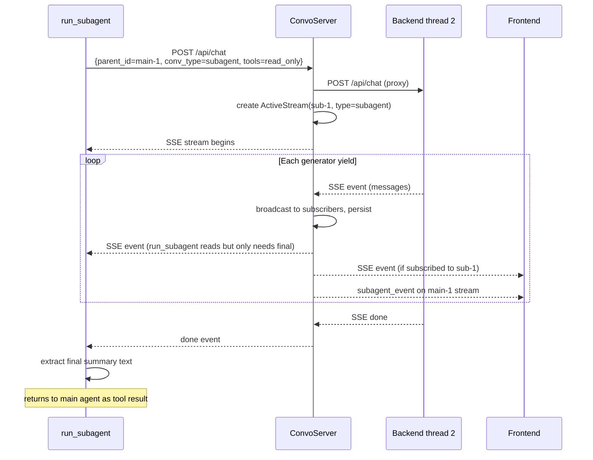

# Subagent Conversation History — Design Document

## Problem

When the main agent calls the `subagent` tool, the subagent runs the same `generate_chat_responses_stream_native` loop — thinking, tool calls, results, text — but all of it is invisible. The user stares at a frozen main stream for the entire duration (up to 15 iterations). The parent only gets a truncated text summary.

## Key Insight: A Subagent IS a Conversation

The subagent runs the exact same generator, produces the exact same SSE events, and needs the exact same streaming + persistence as a main conversation. The only differences are metadata (`parent_id`, `type: "subagent"`, limited tools, lower iteration cap).

Therefore: **a subagent should go through the same pipe as a main conversation** — `POST /api/chat` through the conversation server, proxied to the backend, SSE-streamed back. No special ingest endpoint, no separate mechanism. The conversation server treats it as just another conversation.

## Architecture

```
run_subagent()                ConvoServer (8081)              Backend (8080)
──────────────────────────────────────────────────────────────────────────

POST /api/chat ──────────►  proxy_chat()  ──POST /api/chat──► new thread
  {parent_id, conv_type,     │                                    │
   tools, max_iterations}    │ create ActiveStream(sub-1)         │
                             │ conv_type="subagent"               │
                             │                                    │
read SSE ◄────────────────── │ ◄──────────── SSE stream ◄──────── generator
  (wait for "done")          │   broadcast to subscribers         │  (same loop,
                             │   persist messages                 │   filtered tools)
                             │                                    │
extract summary ◄─── done ── │ ◄──────────── done event ◄──────── generator ends
```

Meanwhile, the frontend can subscribe to the subagent's stream independently:

```
Frontend
────────

GET /conversations/sub-1/stream ──► ConvoServer
                                      │
  ◄── live SSE events ◄──────────────┘  (same subscriber mechanism)
```

## What Changes vs. Main Conversation

Almost nothing. The subagent request is a normal `POST /api/chat` with a few extra fields:

| Field             | Main conversation | Subagent              |
|-------------------|-------------------|-----------------------|
| `parent_id`       | (absent)          | parent conversation ID|
| `conv_type`       | `"user_chat"`     | `"subagent"`          |
| `tools`           | (absent — full)   | `"read_only"` / `"all"` |
| `max_iterations`  | 30 (default)      | 15                    |
| `message`         | human text        | task description      |
| `messages`        | history or null   | null (fresh context)  |

The backend already accepts `message`, `conversation_id`, `messages`, and `provider` in the request body. We add `parent_id`, `conv_type`, `tools`, and `max_iterations` as optional fields. The conversation server passes them through.

## Changes by Layer

### 1. Backend — `POST /api/chat` handler in `app.py`

Accept the new optional fields and thread them through:

```python
@app.post("/api/chat")
async def chat(request: Request):
    body = await request.json()
    # ... existing fields ...
    parent_id = body.get("parent_id")         # NEW
    conv_type = body.get("conv_type", "user_chat")  # NEW
    tools_mode = body.get("tools")            # NEW: "read_only" | "all" | None
    max_iterations = body.get("max_iterations", MAX_ITERATIONS)  # NEW
```

When `tools_mode` is set, compute `tools_override` using the same `_get_filtered_tools` logic that `subagent.py` uses today, and pass it to `stream_chat_response` → `generate_chat_responses_stream_native`.

The system message is built the same way as today for both main and subagent conversations.

### 2. Backend — `src/core_tools/subagent.py`

`run_subagent` changes from calling the generator directly to being an HTTP client:

```python
import os, uuid, json, requests

CONVO_SERVER = os.environ.get("CONVO_SERVER_URL", "http://localhost:8081")

def _get_parent_conversation_id():
    from ..web_api.app import _current_conversation_id
    return getattr(_current_conversation_id, 'value', None)

def run_subagent(task, tools="read_only", provider_id=None):
    child_id = str(uuid.uuid4())
    parent_id = _get_parent_conversation_id()

    # POST through the same pipe as a main conversation
    response = requests.post(
        f"{CONVO_SERVER}/api/chat",
        json={
            "message": task,
            "conversation_id": child_id,
            "parent_id": parent_id,
            "conv_type": "subagent",
            "tools": tools,
            "max_iterations": SUBAGENT_MAX_ITERATIONS,
            "provider": provider_id,
        },
        stream=True,
        timeout=None,
    )

    if response.status_code != 200:
        return f"Subagent error: conversation server returned {response.status_code}"

    # Read the SSE stream to completion — extract final text
    final_text = ""
    final_status = "unknown"
    for line in response.iter_lines(decode_unicode=True):
        if not line or not line.startswith("data:"):
            continue
        try:
            data = json.loads(line[5:].strip())
        except json.JSONDecodeError:
            continue

        if data.get("status"):
            final_status = data["status"]

        # On each event, check for the latest assistant text
        raw_msgs = data.get("raw_messages", [])
        for msg in reversed(raw_msgs):
            if msg.get("role") == "assistant" and msg.get("content"):
                final_text = msg["content"]
                break

    if not final_text:
        final_text = f"[Subagent finished with status '{final_status}' but produced no text summary.]"

    if len(final_text) > SUBAGENT_MAX_RESULT_CHARS:
        final_text = final_text[:SUBAGENT_MAX_RESULT_CHARS] + \
            f"\n... [truncated — {len(final_text)} chars total]"

    return final_text
```

This eliminates:
- Direct import of `generate_chat_responses_stream_native`
- The `_get_filtered_tools` logic (moved to backend's `/api/chat` handler)
- The system message construction (handled by the backend as always)
- Any need for `convert_messages_for_frontend` in subagent.py

The subagent becomes a thin HTTP client. All the heavy lifting (generator, tool execution, message conversion, SSE streaming, persistence) happens through the existing pipeline.

### 3. Backend — `app.py` thread-local conversation ID

Make the parent `conversation_id` available to the subagent tool:

```python
_current_conversation_id = threading.local()

# In run_generator() inside stream_chat_response:
_current_conversation_id.value = conversation_id
```

The generator and all tool calls execute in the same thread, so the thread-local is visible to `run_subagent`.

### 4. Backend — `app.py` tool filtering

Extract `_get_filtered_tools` from `subagent.py` to a shared location (or into `app.py` / `tool_definitions.py`), so the `/api/chat` handler can compute `tools_override` when `tools` is specified in the request.

```python
# In the /api/chat handler:
tools_override = None
if tools_mode:
    tools_override = get_filtered_tools(tools_mode)

# Pass to stream_chat_response / generate_chat_responses_stream_native
```

### 5. Conversation Server — `proxy_chat` in `api.py`

Pass the new fields through to the backend:

```python
@app.post("/api/chat")
async def proxy_chat(request: Request):
    body = await request.json()
    conversation_id = body.get("conversation_id") or str(uuid.uuid4())
    body["conversation_id"] = conversation_id

    conv_type = body.get("conv_type", "user_chat")
    parent_id = body.get("parent_id")

    # 409 guard only for user_chat (subagents are allowed in parallel)
    if conv_type == "user_chat":
        existing = await _has_active_main_stream(exclude=conversation_id)
        if existing:
            return JSONResponse(status_code=409, ...)

    await _cancel_active_stream(conversation_id)

    stream = ActiveStream(
        conversation_id=conversation_id,
        conv_type=conv_type,       # "user_chat" or "subagent"
        provider=body.get("provider"),
    )
    # ... rest is the same ...
```

In `_proxy_backend_stream`, persist with the correct `conv_type` and `parent_id`:

```python
store.create_conversation(
    conversation_id=cid,
    provider_id=stream.provider,
    conv_type=stream.conv_type,     # was hardcoded "user_chat"
    parent_id=parent_id,            # NEW — threaded from request body
)
```

### 6. Conversation Server — parent notification

When a subagent stream sends events, optionally notify the parent's subscribers so the frontend learns about it without polling:

```python
# In _proxy_backend_stream, after broadcasting each event:
if parent_id:
    parent_stream = active_streams.get(parent_id)
    if parent_stream and not parent_stream.finished:
        for q in list(parent_stream.subscribers):
            try:
                q.put_nowait(("subagent_event", {
                    "child_id": cid,
                    "event_type": etype,
                    "status": stream.status,
                }))
            except asyncio.QueueFull:
                pass
```

This gives the frontend real-time awareness: "a subagent just started for your current conversation." The frontend can auto-refresh the sidebar or show an inline indicator.

### 7. Conversation Server — `GET /api/conversations/active`

Include `conv_type` and `parent_id` so the frontend can distinguish and group:

```python
return {
    "active": [
        {
            "conversation_id": s.conversation_id,
            "status": s.status,
            "conv_type": s.conv_type,
            "parent_id": getattr(s, 'parent_id', None),
        }
        for s in active_streams.values()
        if not s.finished
    ]
}
```

### 8. Frontend — `ConversationHistory.jsx`

Remove the `type: 'user_chat'` filter. Group subagents under their parent:

```
 ● Main chat about auth system          2m ago
   ↳ Subagent: review auth middleware   1m ago  ●
   ↳ Subagent: check test coverage      30s ago
 ○ Fix CSS layout bug                   1h ago
```

- Subagent items are indented and show a `↳` prefix
- Clicking opens in read-only view
- Active subagent streams get the green dot

### 9. Frontend — `App.jsx` (subagent view mode)

When loading a subagent conversation:

- Set `viewMode` to `"subagent"`, store `parentConversationId`
- If the subagent is still active, subscribe via `resumeStream()` for live updates
- Hide input area, stop button, continue button
- Show "← Back to parent" link

### 10. Frontend — `ChatMessage.jsx`

First "user" message in subagent view displays "Main Agent" instead of "You":

```jsx
<ChatMessage
  message={msg}
  senderLabel={viewMode === 'subagent' && msg.role === 'user' ? 'Main Agent' : undefined}
/>
```

### 11. Frontend — `api.js`

Handle the new `subagent_event` SSE event type in `streamChat`:

```js
case 'subagent_event':
  onSubagentEvent?.(event.data)
  break
```

## Threading: Why This Doesn't Deadlock

The main agent runs in a backend thread (via `executor.submit`). When it hits a `subagent` tool call, `run_subagent` makes an HTTP POST to the conversation server. The conversation server proxies it back to the backend as a new HTTP request. The backend spawns a **new thread** for the subagent's generator.

```
Thread 1 (main agent):     blocked in run_subagent() → requests.post() → reading SSE
Thread 2 (subagent):       running generator, streaming SSE back
```

As long as the backend's thread pool has capacity for both, there's no deadlock. The default `ThreadPoolExecutor` can handle this. For safety, ensure `max_workers >= 2` (it's already higher).

## Data Flow



## Implementation Order

1. **Backend `app.py`**: Accept `parent_id`, `conv_type`, `tools`, `max_iterations` in `/api/chat`. Thread-local for `conversation_id`.
2. **Backend `app.py`**: Tool filtering logic for `tools` parameter.
3. **Conversation server `api.py`**: Pass new fields through `proxy_chat`. Use `conv_type` in `ActiveStream`. Persist with `parent_id`.
4. **Conversation server `api.py`**: Parent notification (`subagent_event`). Update `GET /active` response.
5. **Backend `subagent.py`**: Rewrite as HTTP client through conversation server.
6. **Frontend `api.js`**: Handle `subagent_event`.
7. **Frontend `ConversationHistory.jsx`**: Show all types, group children.
8. **Frontend `App.jsx`**: `viewMode`, read-only subagent view, `resumeStream` for live.
9. **Frontend `ChatMessage.jsx`**: "Main Agent" label.

## Out of Scope

- **Interacting with subagent conversations**: Read-only. Users watch, not interact.
- **Nested subagents**: Already prevented (subagent tool excluded from subagent's tool set).
- **Concurrent subagents**: Still sequential. The architecture supports parallel if needed later.
- **Cost/token tracking**: Deferred to general cost tracking work.
